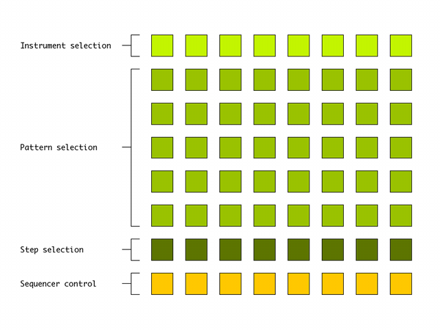

# 8track 

http://github.com/mha/8track

## Introduction 

8Track is a Roland X0X-style MIDI step sequencer with 8
instruments / tracks. It is best suited for percussion, as the
instruments are monophonic and send out a fixed MIDI note (works
well with software like Ableton Drum Racks or Native Instruments
Battery). It is built on top of the [[http://github.com/samaaron/monomer|monomer]] library. 

Each instrument has 40 patterns available with individual lengths
for polyrythmic fun and a randomization function.

You can change the currently playing pattern of an instrument without
changing the playing patterns of other instruments (think Ableton Live
session view).

It is also possible to save all instrument patterns and load them again
at a different time, a feature strangely absent from most other Monome
apps I have seen.

At the moment I have only tested the application with a Monome 64 on
Mac OS X 10.6.4

created by: Martin Alexander Hammer (martin.hammer gmail com)

prefix: /monomer

## Interface 

### 1st row: Instrument selection
Push one of these steps to select an instrument. This will display the
patterns of the selected instrument on the next five rows.

### 2nd to 6th row: Pattern selection
These rows display the patterns of the currently selected instrument.
A lit LED indicates a pattern with steps entered while a flashing LED
indicates the currently selected pattern.

When you select a pattern, it will begin to play (if the sequencer is
running), and you will be able to edit the steps.

### 7th row: Pattern steps
This row shows the actual steps in the selected pattern. A step can
have one of three states; off (LED off), on (LED on) and accented (LED
blinking).

Each step's state is toggled by pushing it once. The "on" state sends
MIDI velocity 75, while an accented step sends a velocity of 100.

Hold the first step button for a moment to randomize the pattern.

### 8th row: Sequencer control and status
The leftmost button starts and stops playback. If held for a moment, it
will save the current patterns to disk (two flashes of all buttons
indicate the start and finish of the save operation).

This row also shows the "running light" indicating the currently active
step in a sequence.

The default sequence length is the entire width of your Monome, but
hold one of the steps in this row to set the last step in a pattern
(this does not affect the length of other patterns).