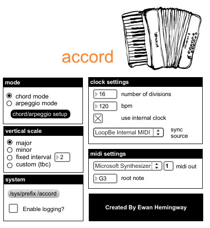

# accord

"Accordion style chord mapping with built-in chiptune style arpeggiator."

Accord is named after its similarity to the left hand bass on a accordion. The vertical axis of the monome dictates the root of the chord, and the column number specifies the "chord" played. For example, the accordion is roughly set up like:

<code>

**C** | maj | min | maj7 | min7 | aug | dim | etc |

**G** | maj | min | maj7 | min7 | aug | dim | etc |

**D** | maj | min | maj7 | min7 | aug | dim | etc |

**A** | maj | min | maj7 | min7 | aug | dim | etc |
</code>

The chords in this app aren't restricted to the set above, rather the notes of the chord are editable - you specify the intervals from the root note in semitones. There is an internal clock, or you can sync to an external source. Pressing a button either triggers:

* a very fast arpeggio, making the app ideal for chiptune type music, i.e. with basic monophonic synths. 
* or a single chord

**todo:** 

* preset saving
* pattern editor

**created by:** ewan hemingway

**more info:** http://ewanhemingway.co.uk/programming/puredata-maxmsp/accord

**prefix:** /accord

http://www.youtube.com/watch?v=54iY-OalJwk