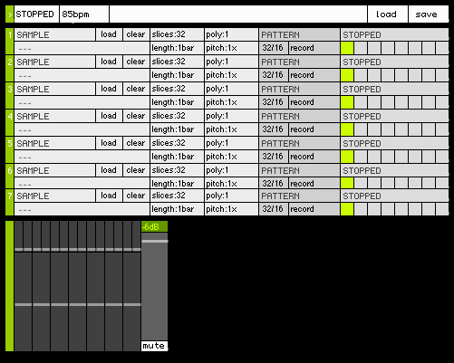

# Axiome

## Concept

Axiome is basically a port of [[app:mlr]].
It has few main differences with the mother app though:

* It is for now only developed for the 40h (but a port would be quite easy).
* Made in http://puredata.info patching environment.
* Samples are sliced -> pitch does not affect speed.
* Stopping track does not stop pattern.
* It has no audio recording capabilities (maybe in the future!).
* No "quick-looping" functionality (you can achieve this by setting an appropriate record length...)

http://gwen.coffy.name/Puredata/Axiome