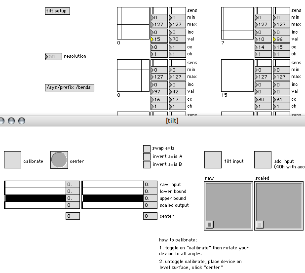

# bends

multiple two-dimensional tilt-interfaced controllers

**Created by:** tehn

**Prefix:** /bends

**Long description:**

acts as a banked tilt accumulator-- only the selected banks (specified by held keypads) are updated with the current tilt offsets.

various output scaling can be applied. cc/ch specifiable.

both 64 tilt and 40h accel via ADC are supported.

axis swap and inversion supported. calibration and centering provided.

currently only eight "banks" added. (0,0-3) and (7,0-3). (first four rows of the leftmost and rightmost columns).

this is more of an example patch that can easily be added to other applications (if you program max/msp).