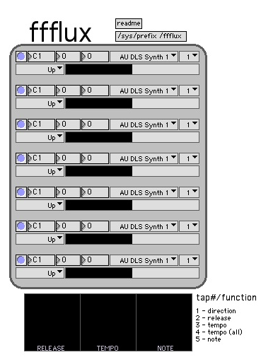

# ffflux

written by jason r kramer for the 40h or 64

prefix: /ffflux

description:

7 note sequencer, notes travel vertically in a variety of directions and are coupled with velocity. the closer - the louder. you can set the tempo at which they notes travel independently from each other. built with max 4

instructions:

- set prefix to /ffflux
- assign MIDI output for all channels as desired
- push buttons

channel columns - each of the seven left columns are channels assigned independently to any MIDI device. their notes travel up, down or up and down getting louder (in velocity) the closer it gets to you. pressing a button within a column changes that channels tempo, which can vary greatly depending on the tempo range. the closer to the top; the faster, only just slightly enough to fall in and out of rhythm as the arpeggio grows. while a button is down it momentarily pauses that channel.

control strip - each of the seven columns from left to right correspond with the right most column's buttons from top to bottom. these buttons turn the appropriate channel on and off and light up when a channel is active. the bottom right button is multifunctional depending on the number of times it's pressed within a half second. after 1 second the function is realized (number of taps is counted) and performed. if you tap it once the direction of all channels is randomized, twice the release is randomized, three times the tempo range is randomized, four times the tempo range is uniformly randomized across all channels, and five times the notes are randomized. the range of randomization can be set for release, tempo and note from the three sliders on the bottom of the patch.