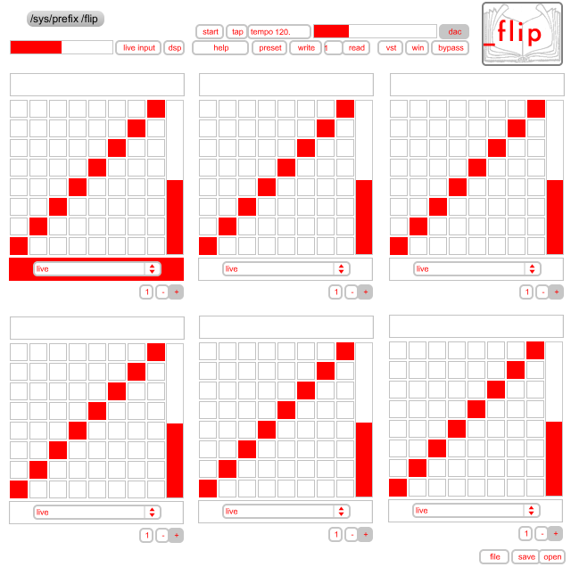

Original written by Peter Segerstrom 

Current Version by Axolotl

_flip, a multi-voiced reslicer. 

flip is a program that allows you to cut up sound files into rhythmic units and reorder them to be played back as a pattern. you can save pattern states and then recall them there by varying the playback of a drum sample for example. really that's what this is best for... drums. 