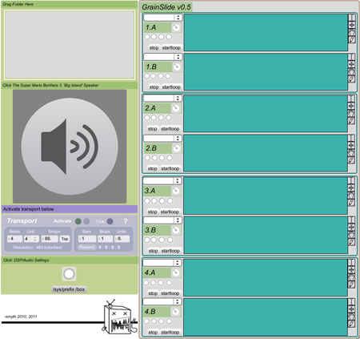

# grainslide

multi-loop, non-quantized sampler with independent speed/pitch controls and delay

created by: jared smith -- http://jaredsmyth.info

Four groups of sample loop playback, a+b for each group

Eight sample banks total

Dynamic control over sample length through a series of draw functions within max/msp GUI: Can be used as waveform synthesis by drawing in millisecond looping, and drawing your own waveforms

Four global pitch/speed time controls

Four global REVERSE pitch/speed controls

&

Four pitch/speed controls for each (a+b) sample

Four L/R sliders in center of 64 grid for control of sample delay playback over each of the four groups of samples

and drag-n-drop functionality for folders of wav, mp3, or aiff, samples

http://vimeo.com/18332486