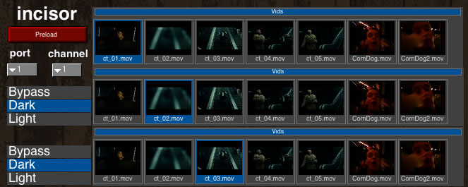

# Incisor

This project uses http://troikatronix.com/isadora.html Isadora to read MIDI coming from a molar instance and control corresponding videos for real-time manipulation and performance.

created by: Momo The Monster

prefix: whatever you use for Molar

Incisor looks for MIDI notes coming from Molar and translates them into position and visibility data for movies playing within Isadora. You can fully utilize this patch using the demo version of Isadora -no watermarking or expiration. The only function you will not have is saving, meaning you will have to load up your movies each time.

## tutorials

http://code.google.com/p/incisor/wiki/GettingStarted

## media

http://vimeo.com/3025900