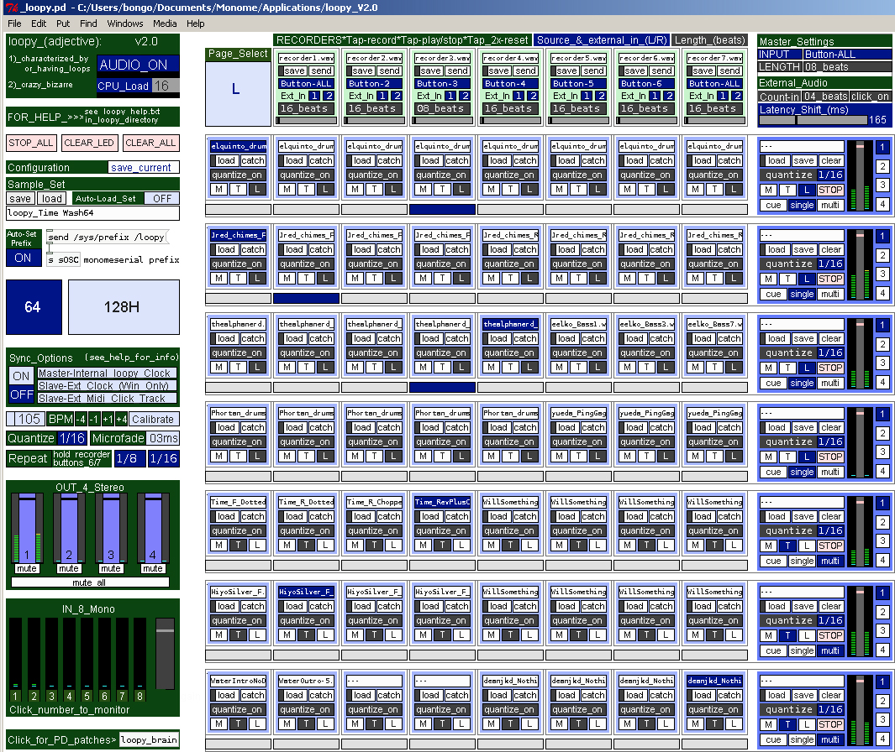

# loopy

/loopy/ (adjective): 1) having or characterized by loops 2) crazy, bizarre

/loopy/ is a Pure Data based sample player for use with a monome combining a large sample bank and multiple trigger modes - momentary, one-shot, loop - with flexible recorders and simple mlr-like sample cutting. Each row can be defined independently to function like a multi-sample one shot player or a bank from which to choose a sample to be sliced.

**created by**: bongo

**prefix**: loopy

**full documentation**: [[http://www.bongoware.com/documentation/loopy_help.html]]

## overview

/loopy/, written in the open source Pure Data (pd) environment, provides a bank of 56 (7 rows x 8 columns) which can be triggered in momentary, trigger once (one-shot) or loop modes, and also can be sliced in mlr-like fashion. 

/loopy/ also provides 7 recorders, which can record button presses, internal audio and external audio; and once recorded, loops can be assigned to sample bank buttons.

## /loopy/ features

- Standalone pd application, requiring pd extended & your samples only

- Monome configuration: 64 or 128H

- 56 sample bank locations (7 rows x 8 columns)

- 7 recorders, each of which can record button presses from all rows, button presses from a single row, audio from all rows, audio from a single row, or external audio from a number of input channels. Once audio is recorded, it can be assigned to a sample bank location or saved to an external wave file for future use.

- Each row can be played in 'multi', 'single' or 'cue' mode

- Each sample can be triggered in 'momentary', 'trigger' once or 'loop' modes

- When in loop mode, 'sub-loop' capability allows a portion of a sample to be looped.

- 'Repeat' feature allows a button press to be automatically repeated on a quantized beat, providing a stutter effect.

- Quantization can be set globally or by row, and can be turned on/off at the individual sample level

- Save/load of sample sets and configuration parameters

## quick start

IF AT ANY TIME YOU WANT TO STOP ALL SOUND, PRESS AND HOLD FOR 3 SECONDS THE TOP LEFT BUTTON ON THE MONOME OR CLICK THE BUTTON ON THE MAIN loopy SCREEN WHERE IT SAYS 'stop all.'

- Select Audio setting... from the pd Media menu. Set output device 1 to your active sound device.

- Select monome layout (64 or 128) on left side of the main //loopy// screen.

- Click to send prefix setting to monomeserial (prefix is /loopy) on the main loopy screen.

- Click 'load' to select audio file for sample 0 in row 1 (top left) on main //loopy// screen.

- Press and hold leftmost button on second row of monome to begin playback. Release button to stop.

- Click row mode 'single' for row 1 on right side of main //loopy// screen. Then click sample mode 'L' (for Loop) just above this. Tap and release leftmost button on second row of monome to begin playback. On 128 led's should sequence on right hand side as sample plays. On 64 tap top left button on monome to toggle to 'right' page, and led's in second row should sequence as sample plays.

- Tap buttons in second row to to play (cut) from different points within the sample.

- On 64 tap top left button on monome to toggle to 'left' page. On 64 or 128 tap leftmost button in second row to stop sample play.

## help

full documentation available in the file 'loopy_help.html' found in the main //loopy// directory.

