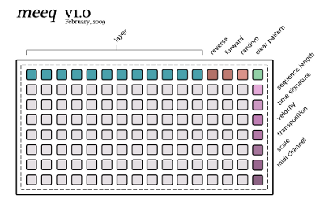

#  meeq 

a multi-layered, polyphonic, polyrhythmic and dynamic MIDI step sequencer written in the chuck programming language.

created by: Graham Morrison

**prefix:** /meeq

**features:**
forward, backward and random play. allows for the dynamic adjustment of step sizes, timing, MIDI channels and custom scales, plus both short and sustained notes. should work on the 64, 128 and 256.

**download:**

v1.0: http://www.paldandy.com/meeq/v100/meeq_v1.ck

**tutorials:**

a PDF cheat cheat with all the controls can be found here: http://www.paldandy.com/meeq/v100/meeq_v1.pdf

**QUICK SETUP INSTRUCTIONS**

Get Chuck:
http://chuck.cs.princeton.edu/

Only works from the command-line version of Chuck and not the miniAudicle GUI. Chuck needs to be installed and in your path.

1. Find the MIDI device name you want to output notes to by typing:
  chuck --probe

2. Open the source code in a text editor. Copy the device name within the double quotes into following line:
  "PLACE DEVICE NAME HERE" => string midioutstring; 

3. Define the dimensions of your monome. Maxx holds the width, while maxy hold the height
eg. for monome 64
  08 => int maxx;
  08 => int maxy; 
for monome 128
  16 => int maxx;
  08 => int maxy;

4. Set the global tempo for meeq by changing 120 in the following line:
  120 => int bpm;

5. Run MonomeSerial and set the prefix to /meeq

6. Type //chuck meeq_v1.ck// on the command-line to run the sequencer.

**media:**

http://vimeo.com/3072632