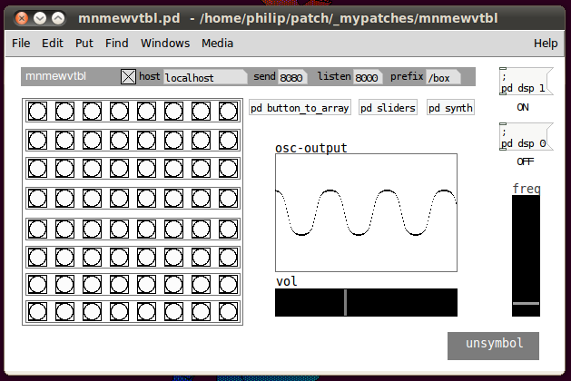

# mnmewvtbl

**Author:** unsymbol

**Prefix:** /box

## Description

mnmewvtbl is a 3-bit by 3-bit monome waveform editor for pd. the 8 x 8 grid is a representation of an audio waveform, whose shape is controlled by the grid.

**Media:**

http://vimeo.com/13121970