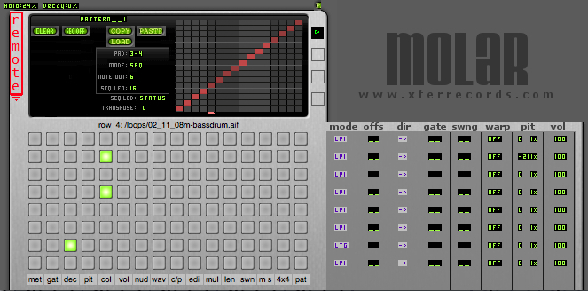

# Molar VSTi

http://xferrecords.com/molar

created by: steve_duda

prefix: edit in config file
Plug in for the monome with audio abilities.
Molar is an extended version of the MonoChrome plugin.  Both plugins allow you to sync to host tempo and generate MIDI sequences of notes, or use your Monome like a MIDI keyboard.

However Molar also allows you to load AudioFiles as loops or one-shot, and/or capture/manipulate a live Audio Input signal.

Unofficial Molar VSTi Functions Overview:

http://www.google.com/base/a/4740701/D3875723320633660989

Molar is donationware - paypal steve (AT) duda.org

tutorials:

http://youtube.com/watch?v=T0ioVm1sK9s

media

http://youtube.com/results?search_query=Molar+VSTi&search_type=