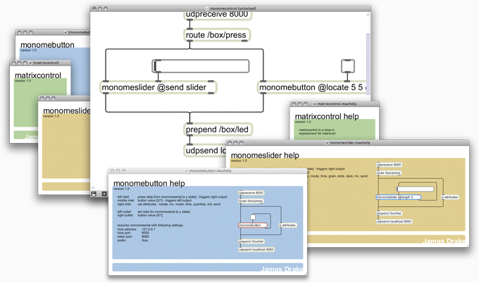

# monomecontrol objects

Created by: James Drake.

A collection of abstractions written in Max/MSP 5 used to build monome interfaces. Documentation included as .maxhelp files.

http://www.vimeo.com/4504030

## matrixcontrol

A drop-in replacement for matrixctrl. Use it when you want the functionality of matrixctrl without wasting loads of space in your patch.

## monomebutton
Create buttons. Various styles, including features like button press quantisation.

## monomeslider
Create faders that have fine control over your patches with various options for LED feedback. Requires matrixcontrol.

## monomepage
Create multi-page monome apps with minimum fuss. Requires matrixcontrol.