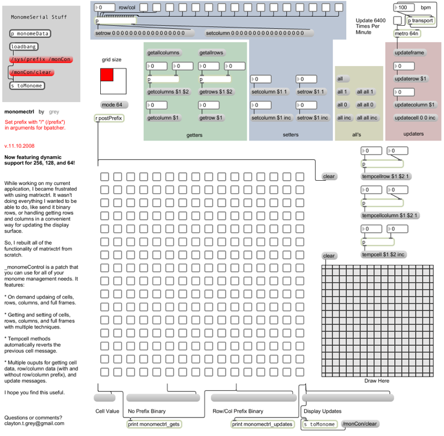

# monomectrl

While working on my current application, I became frustrated with using matrixctrl. It wasn't doing everything I wanted to be able to do, like send it binary rows, or handling getting rows and columns in a convenient way for updating the display surface. So, I rebuilt all of the functionality of matrixctrl from scratch.

The end result is /monomectrl/ a patch that you can use for all of your monome management needs. 

You should be able to replace any matrixctrl in any patch that you've already made with this with no problems.

It features:

* /Support for monome 64, 128, and 256/ - Now, by sending a 'mode 64', 'mode 128', or 'mode 256' message, you can dynamically change the way gets/updates are processed. Changing modes is non-destructive (the entire grid's data remains intact no matter how many mode changes you make), it merely reduces the processing required to get column and rows and generate monome update messages. Just resize the bpatcher to hide any parts that you don't want to see.

* /tempcell/tempcellrow/tempcellcolumn/ - These methods automatically revert the previous cell message. The row and column versions do the same thing as tempcell, except they are row/column dependent instead of unique to the entire grid.

* /Display Updating/ - On demand display updaing of cells, rows, columns, and full frames.

* /Getters and Setters/ - Getting and setting of cells, rows, columns, and full frames with multiple techniques.

* /Multiple Ouputs/ - Get cell data, row/column data (with and without row/column prefix), and update messages.

Check out the included test patch to test out all of the functionality.

I've done my darndest to weed out bugs, but chances are I missed a few. Please let me know if you spot any. I've tried to make it as fast as possible, but there will probably be some optimization in the future. If you see any spots that can be cleaned up, feel free to post code and I'll add it into the official release. Also, if there's some bit of matrixctrl that I missed, please let me know, and I'll try to add that in too.

I hope you find this useful. I know it will help me in my work. I hope it helps you too!