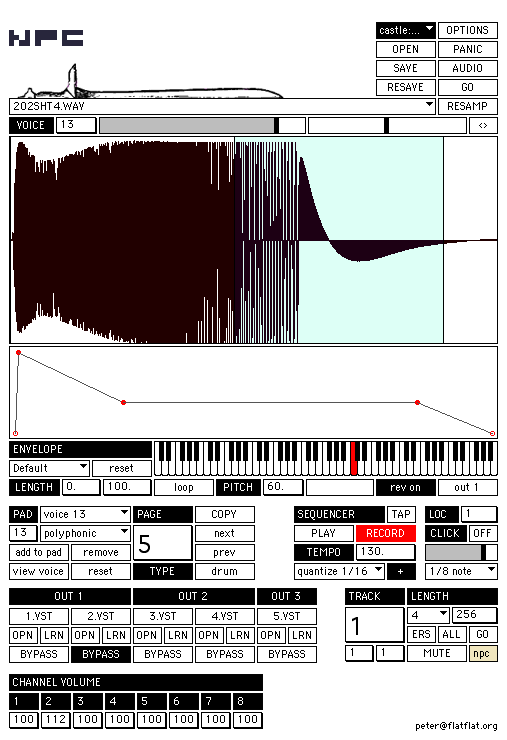

# npc

the mpc application for monomes!

by Peter Segerstrom -- http://flatflat.org

requires maxmsp 4.6 runtime or full version (max5 experimental) and monomeserial + any size monome

http://vimeo.com/1864382

## QUICKSTART

open a recent version of monomeserial

set the address prefix in monomeserial to 'npc'

download, unzip and open npc in max 4.6 runtime or full version from cycling74.com

Make sure audio is on in the upper left hand corner of the npc window by clicking the audio button.

Drag sounds onto waveform display directly below 'VOICE'

Click 'OPTIONS' in the upper left hand corner and then click GENERATE under the heading PAD GENERATOR SLICER

Taps some pads on the lower half of your monome and start playing!

hit return to start playback. click the off button next to the click button to turn on the metronome.

hit a button on the upper half of your monome, then hit the space bar. then hit the R key.

tap out a pattern with the pads. your pattern should be recorded. IF you made a mistake hit the c key twice. replay your pattern.

unmute a different track. hit the spacebar to select that track. hit r again to go into record mode. tap out a pattern using different pads.

hit a pad that has a sound you'd like to fix. hit the V key or the enter key. the data for that voice should come up in the voice area. edit away. repeat.

## NPC README

This program is a rough emulation of the software of an akai mpc. It utilizes the open source hardware developed by monome.org. Below some basic definitions are outlined along with step by step instructions for creating a piece of music with npc.

sound / sample - these are either wav or aif files that you drag and drop onto the main waveform window of npc. 
each sample can only be heard in npc if it is used by a voice.

voice - voices are the intermediate step between a sample and a pad on your monome. you must either hand make or generate voices via the options window, and then assign these voices to a pad. voices use one sample each and have the following parameters.

- sample - the sample or sound assosciated with this voice
- volume - this is the volume that you will hear the sample you have selected for this voice
- panning - the panning of this voice
- envelope - the 5 point adsr envelope for changing the attack and decay of this sound.
- start point - the beginning point of playback within the sample defined by the selection in the waveform window 
- end point - the ending point of playback within the sample defined by the selection in the waveform window 
- loop toggle - this specifies whether the sound loops plays in one shot mode. 
- if loop is on, the length parameter dictates how long you will hear the voice regardless of the start and end point selection of the sample. - the envelope is consequently mapped to the the length value as well.
- if loop is off, the sample will playback in oneshot mode, and the envelope is mapped to the length of the selection within the sample.

loop length - the length of time you will hear the sound if loop is enabled.
pitch - the pitch of playback. in standard 12 note tuning
fine pitch - this will interpolate between half steps by 100 cents
reverse toggle - this will reverse the playback of the sound
output routing - this specifies which output the sound will playback through, and consequently which group of vsts the sound will playback through. all sounds that have the same output routing are globally controllable by that channels volume.

pad - a pad refers to the pads on your monome. to hear sound from npc you must have one or more voices assigned to a pad and then press that pad. you may create several voices and then select a pad and click the 'add to pad' button to add multiple voices to one pad. to edit each voice simple hit enter or v to toggle between the various voices on the selected pad.

*currently the pads you have access to are on the bottom half of your monome, while tracks are on the top half*

track - a track is a recording of a playing one or more pads. to record a track, unmute it by hitting the button. it should light up, you may then hit the space bar to select that track. you will see the track number and it's row and column value updated in the npc window. hit the return key to begin playback and hit the r key or record on the screen to begin recording. tap various pads to hear them recorded. quantization is on by default but can be turned off in the prefs text file in the npc folder and of course toggled in the npc window itself. each track can have an independent length and the default length can be set in the prefs text file.