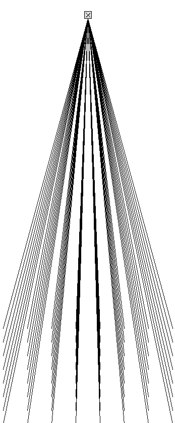

# _ohm_

created by: dataplex

prefix: /klive

Harmonic theory was established back in Greece (590 b.c.) by mathematician Pythagoras. To make a long story short, his teachings focused on a three dimensional model called the Lambdoma. It's formed by combining the ratios of the arithmetic, harmonic and geometric series into one form.

This patch maps out a 8x8 lambdoma-matrix of ratios, so that a given frequency may be harmonized according to the pythagorean ratios. Kind of the //Monochord// of the 21st century...!

for more information read this;

http://drewlesso.com/index.php?option=com_content&task=view&id=81&Itemid=36

...and check out barbara hero on google.

http://vimeo.com/klive/videos

http://www.myspace.com/kliveisklive/