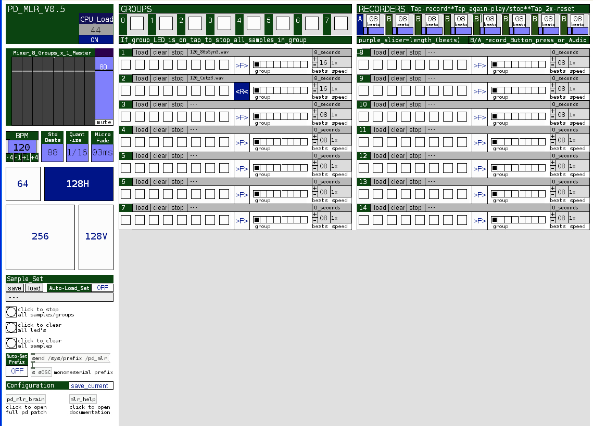

# pd_mlr

pd_mlr is Pure Data based sample cutter based upon the original mlr (thanks Tehn).

**created by**: bongo

**prefix**: pd_mlr

## overview

pd_mlr is a sample cutter based upon the original mlr (thanks Tehn), the work of Gwen (Axiome) and @ucacjbs & @smioliolio (pd and max mlr tutorials, respectively) written in the open source Pure Data (pd) environment. I undertook this project to 1) learn more about pd; and 2) to create a sample cutter for my 128 with more groups and more recorders.

pd_mlr features:

- Monome configuration: 64, 128H, 128V, 256

- 4 groups + 4 recorders for 64 or 128V; 8 groups + 8 recorders for 128H or 256

- each recorder can record either button presses or audio; recorder length adjustable from 4-32 beats; recorder can toggle play/stop

- quantization

- "intelligent" sample load, which finds nearest multiple of standard beats

- save/load of sample sets and configuration parameters

The implementation of some of these features is unorthodox, so read the help file (click mlr_help box) for details - especially for the pattern recorders.

**help**: full documentation available by clicking 'mlr_help' button on bottom left of main application screen.

