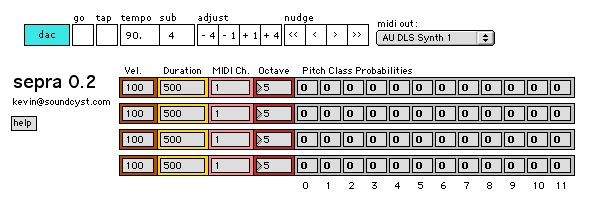
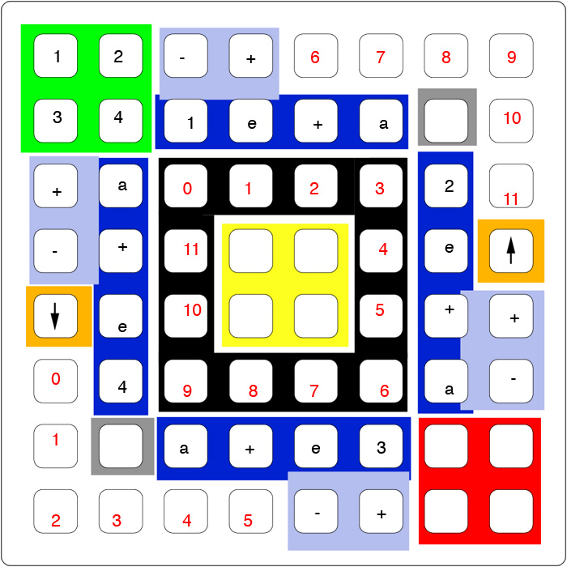

# sepra

sepra is a probability-based generative MIDI step sequencer with 4 voices.

**prefix:** /box

it has a unique and complex (and if we're lucky, functional) 40h interface, best described with both an image and text. there is also a tutorial video at http://www.vimeo.com/359147

here is the image:

the **green** and **red** squares in the corners are edit toggles for each of the voices. the buttons in the green square toggle edit pages for the step sequencer and the pitch class set. the red square is for editing probabilities.

the **yellow** square in the middle is a voice output toggle. if all of these are off, you won’t get any midi data.

the **dark blue** ring is a circular step sequencer, which progresses as shown by the text.

the **black** ring defines a pitch class set. each voice has its own pitch class set and its own rhythm, as defined by the step sequencer.

the **light blue** +/- buttons change which pitch class & probability structure the sequences are associated with. this is kindof like decoupling. the one on top corresponds to voice 1, right to voice 2, bottom to 3, and left to 4. increment is always up or right. the current assignment is displayed in binary offset by -1. each voice defaults to its own pitch class set.

the buttons with the **white** background increase or decrease the probability of a pitch class coming through as a note, depending on which **orange** button (the ones with arrows) is lit. pressing any of these while the right button (the one with the up arrow) is lit will increase that pitch class’ probability. with the left button lit up, they will decrease.

the **grey** buttons along the diagonal don’t do anything right now, but i was thinking they’d be preset scrollers or something. next and previous on the left and right.

that seems like everything. post to the forum with any questions. use your favorite synth.