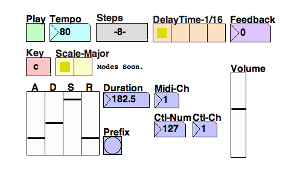

# step-o-potamus

Variable Length Audio/Midi Step Sequencer w/ Built In Delay v0.1-1

created by: Scott McCoid

prefix: /sop

step-o-potamus is a variable length monophonic audio/midi step sequencer built in Pure Data. It contains multiple pages to adjust octave, velocity, FX send, and key.

Please use [[http://puredata.info/downloads|Pd-extended]]. The Open Sound Control objects and a couple others I use are included only in Pd-extended.

step-o-potamus currently has 5 different pages. To access each page you need to press and hold the correct button to access the page. It should be able to determine a page selection from a button press on that page.

* Page 1 (0,0): - Monophonic Pitch Selection 
* Page 2 (1,0): - Octave Selection (Pick octave for each step)
* Page 3 (2,0): - Velocity Amount (default is max velocity)
* Page 4 (3,0): - FX Send Amount
* Page 5 (4,0): - Key Selection

Page 4 is an FX send to the delay line. This is the amount of the signal that gets sent to the delay line for each step. For example, If you only want step 1 to repeat, go to page 4, and press one of the top row buttons. Depending on the delay time and feedback will determine the sound. This can also be use to control a midi control change value in order to change a parameter in a software synth. 

Page 5 determines which key the sequence is in. You can also adjust this from the main interface by dragging the box that says "Key" upwards. The default is middle C in the Major scale.

You can also adjust the number of steps above 8. To navigate to steps 9-16 press and hold the bottom right button (7,7). To navigate back to steps 1-8 press and hold the bottom left button (0,7).