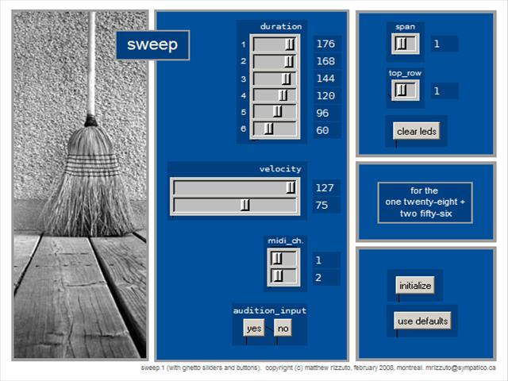

# sweep

**sweep** is a wide-range, rapid chord player; a lightweight and super-responsive live performance tool.    

created by: matthew rizzuto, february 2008, montréal 

prefix: **/box** (see description)

description:

sweep is a utility, or mini-application, for the //two fifty six// or //one twenty eight// in pd. in two words, it's a 'chord player'. in more words, it's a purposefully minimal midi controller intended as a lightweight and super-responsive live performance tool.

for my own //two fifty six// performance needs, i'm developing a collection of single-purpose and lightweight musical utilities in pd which can be run singly or combined and permutated non-exhaustively. essentially these are thought of as a family of mini-applications which can be endlessly compiled in real-time into temporary, 'full featured' applications.  sweep is the first such utility, and my first large commitment in pd.  i am hoping the remainder of these little works will be produced much more quickly, as my familiarity with this wonderful programming environment increases.

for the moment, the prefix is /box.  eventually, i'll need to be able to manipulate and initialize these mini-apps without needing to return to the computer each time, so, as i create more of them i'm bound to begin exploring dynamic prefix switching.  in the future the prefix for these utilities will be open, to be chosen by the user.  /box, however, is hard-coded into version 1.

sweep occupies 6 rows total, and the complete 16 button breadth. the default placement is on row 1 so that it initializes safely on both the //two fifty six// and //one twenty eight//. the top row of sweep can be placed on 0 or 1 on the //one twenty eight//, and 0 to 10 on the //two fifty six//.  this leaves the remaining 10 rows of the //two fifty six// and 2 rows of the //one twenty eight// open for other uses.

http://vimeo.com/706365

## quick start:

- open monomeserial>host 8000, listen 8080>prefix is /box
- open pd extended 0.39.3>choose a single midi output device
- open synth/host>choose corresponding midi input device
- open '_sweep' in pd>ensure there are no non-initialized objects, but ignore the rest
- click 'use defaults'.

- consult the 'sweep controls.pdf' file

- input a duration, velocity, midi channel, and play mode (solid/broken) on the monome 'control frame' which appears after you click 'use defaults'
- input a bunch of notes in the 'notefield' (max is 12 before clearing)
- press 'play+repeat', press it again.

http://vimeo.com/702112