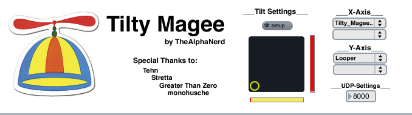

# Tilty Magee

Update Oct 28th

Now with added max4live support.  I forgo midi CC and took the code from parastepper.  In this version you can control any automatable control within a tracks.  Interesting about this version is that everything is being sent by a float...

About Max/msp version

Tilty Magee is an open ended tool to allow you to turn the accelerometer data of your monome into midi cc data.  One of the advantages of this tool is that it remains active regardless of monome serials current prefix.

created by: TheAlphanerd

prefix: /prefix (loads on launch for calibration)

Instructions:

1) Set your port under UDP-Settings to be the same port as 'host port' in monome serial

2)Click on the tilt setup button in the "Tilt Settings" area of the patch.  From there follow the on screen instructions to turn on and calibrate your accelerometer. After calibrating close window

3)In the main app window you can now set the midi CC value for your x / y axis control information, the midi channel number, and the midi device to send information to

4) Toggle on and off Sends to send data

Special Thanks go out to 
Tehn, Stretta, Greater Than Zero, monohusche... and of courses our viewers at home
