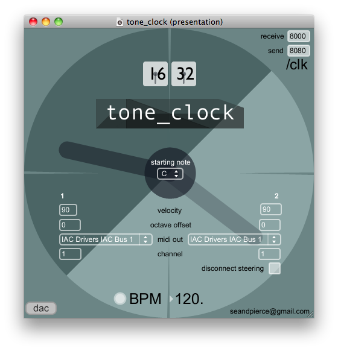

# tone_clock

A dual keyboard harmony app based on peter schat's tone clock ideas.

created by: Sean Pierce (stevieraysean)

prefix: /clk

use the two arms on either side to select the intervals from the root note you want to use from 1 semitone to 11. the left one starts at the bottom and the right one starts at the top. two 3x6 keyboards in the middle are playable to different midi outputs. there is also a tap tempo and two pattern recorders in the gap at the top and the steering buttons are in the gap at the bottom. check the info.pdf for button layouts.

media

* http://www.hoogstins.com/toonklok/index.html

* http://www.vimeo.com/7400539