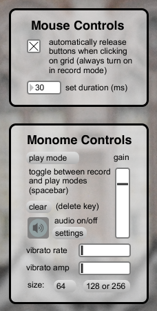

# tone map

created by: Amanda Ghassaei

prefix: tone

Tone map records the frequencies and amplitudes of an incoming audio signal as you drag your finger across the monome grid.  In play mode these frequencies and amplitudes are re-synthesized when the lit buttons are pressed.  Requires the pitch~ object, which can be downloaded here:

http://web.media.mit.edu/~tristan/maxmsp.html

put .mxo/.mxe file in Max/Cycling_'74/msp-externals/

put .help file in Max/Cycling_'74/msp-help/

windows also requires fftw3 (http://www.fftw.org/install/windows.html), see README in the pitch~ folder

Inspired by the IPad app "singing fingers."