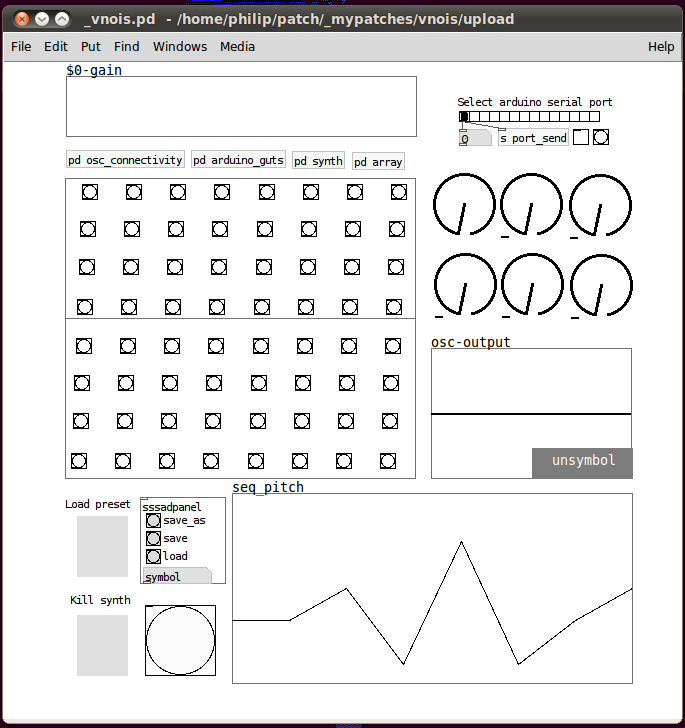

# vnois

**Author:** unsymbol

**Prefix:** /box

**Description:** vnois is a step sequencer with built-in synthesis & effects for monome & arduino. some parameters can be modulated by the performer, whilst others are controlled by generative processes. if you would like to use vnois with an arduino to control the six knobs then download {{:app:vnois.zip|vnois}} & upload simplemessage system to your arduino (available in arduino 0004 & up). else download {{:app:vnois_noarduino.zip|vnois_no arduino}} & use the knobs in the patch to control the effects.

**Details:**

* knob 1 - tempo
* knob 2 - volume
* knob 3 - eq wet/dry
* knob 4 - null
* knob 5 - feeback delay
* knob 6 - feedback delay

**Requirements:**

[polywavesynth] abstraction: http://www.pkstonemusic.com/polyWaveSynth.html

**Media:**

http://vimeo.com/13147753